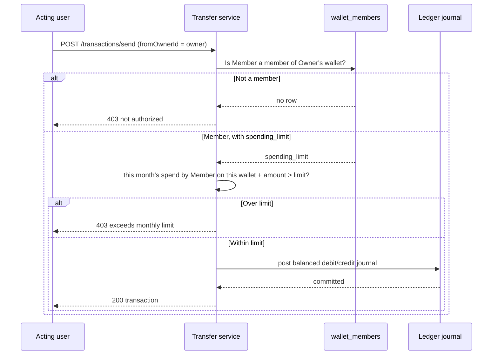
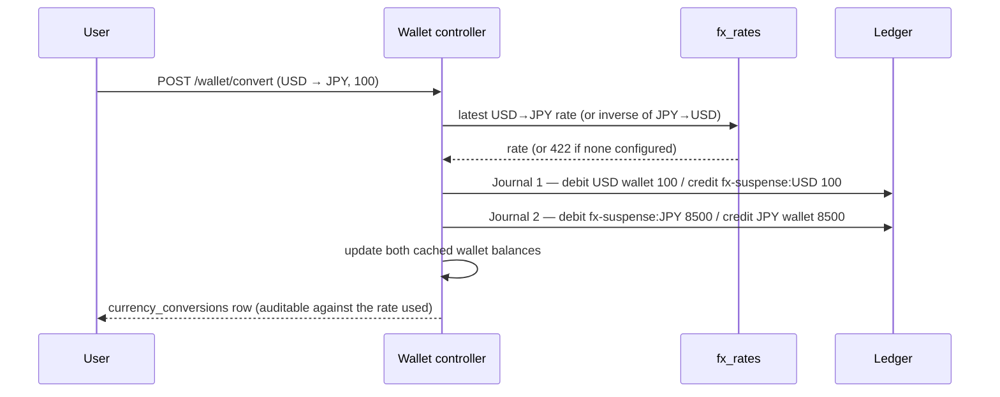

# Architecture

`digiwallsys` separates an untrusted Expo client (mobile and web, one codebase),
an authorization/business API, an immutable PostgreSQL financial core, and
configurable external adapters.

## Components

```text
Mobile + Web (same Expo codebase)
  ├─ Secure session and biometric gate (mobile) / persisted refresh (web)
  ├─ Web renders a persistent sidebar shell instead of the mobile stack
  ├─ Wallet, funding, send, request, QR, schedule, history, and alerts
  ├─ Analytics, savings goals, budget categories, payment calendar
  ├─ Multi-currency wallets, self-service conversion, family wallets
  └─ Administrator operations (role-visible only)
        │ HTTPS · JWT · Idempotency-Key
API
  ├─ Authentication and role middleware
  ├─ Funding webhook trust boundary
  ├─ Transfer, fraud, ledger, FX, audit, and notification services
  └─ Schedule, email, and push workers
        │ Parameterized SQL · database transactions
PostgreSQL
  ├─ Users, rotating sessions, action tokens, and delivery outbox
  ├─ Multi-currency wallet cache, wallet_members (shared/family wallets)
  ├─ Immutable ledger accounts/journals/entries, FX suspense accounts
  ├─ Funding, transactions (tagged by category and spender), requests, schedules
  ├─ Savings goals, budget categories, fx_rates, currency_conversions
  └─ Fraud, notifications, audit logs, and reconciliation runs
```

## Money movement

A direct, requested, QR, or scheduled payment calls the same transfer service:

1. Resolve the sender's wallet by `(userId, currency)` — or, when spending from
   a shared wallet, by `(delegatedOwnerId, currency)` after verifying
   membership and any monthly `spending_limit` for the acting user.
2. Assess amount and velocity risk for the acting user.
3. Lock sender and receiver wallets in ascending user order.
4. Validate matching currency and cached balance.
5. Create one ledger journal with equal debit and credit entries.
6. Update both cached wallet balances.
7. Record the transaction UUID reference, optional budget category, and the
   acting user's ID (`spender_userid` — distinct from the wallet owner when
   spending from a shared wallet).
8. Create notifications, spending alerts, and an audit event.
9. Commit everything together or roll everything back.

Deferred PostgreSQL constraint triggers reject an unbalanced journal at commit.
Separate triggers reject updates or deletes to posted journals and entries.
Every step above is unchanged for a user who has never used multi-currency or
shared wallets — the new parameters default to the user's own USD wallet.



## Currency conversion

Converting between a user's own wallets is **not** a single cross-currency
ledger journal — `postJournal()`'s balance check compares raw debit and credit
amounts, and a 100 USD → 8,500 JPY journal cannot balance in raw units without
weakening that check for every other caller. Instead, conversion posts two
independently-balanced, same-currency journals against a system FX suspense
account per currency:



Each journal individually satisfies the existing balance check; the two
suspense-account legs net against each other across the pair over time. Rates
are append-only (`fx_rates`), so a past conversion stays auditable against the
rate actually in effect when it happened, never a value that was later edited.

## Funding trust boundary

Creating a funding intent does not add money. The provider receives a unique
reference. A webhook must have a valid HMAC signature and unique provider event
ID. Only then does the API lock the intent and wallet, post a provider-clearing
debit plus wallet credit, update the cached balance, and commit the event.

## Sessions

Passwords are hashed with bcryptjs. Email must be verified before login. Access
tokens are short-lived JWTs; opaque refresh tokens are hashed in PostgreSQL and
rotated at every use. Reuse of a revoked refresh token revokes the user's session
family. Password reset also revokes all sessions.

Mobile tokens live in Expo SecureStore. Biometric login authenticates locally
before using the saved refresh token to obtain a new session. On web, the same
refresh-token flow persists the session across reloads; there is no biometric
step, and no shared wallet ever grants elevated session privileges — membership
only ever authorizes spending from one additional wallet.

## Idempotency and concurrency

Protected writes reserve a `(user, scope, key)` record with a request hash. A
completed replay returns the original response; a changed payload or in-flight
duplicate returns `409`. Wallet locks prevent concurrent transfers from
overdrawing the same balance.

## Background workers

- Schedule worker claims due rows with `FOR UPDATE SKIP LOCKED` and uses the
  normal transfer service.
- Notification worker sends persisted events to active Expo push tokens.
- Email worker forwards outbox messages to a configured delivery webhook.

Payment commits never depend on push or email provider availability.

## Administrator boundary

Administrator routes verify the current role from PostgreSQL on every request.
The console can view metrics, audit/risk records, review fraud events, start
wallet-to-ledger reconciliation, and set the exchange rates conversion depends
on. These actions create their own audit events.
